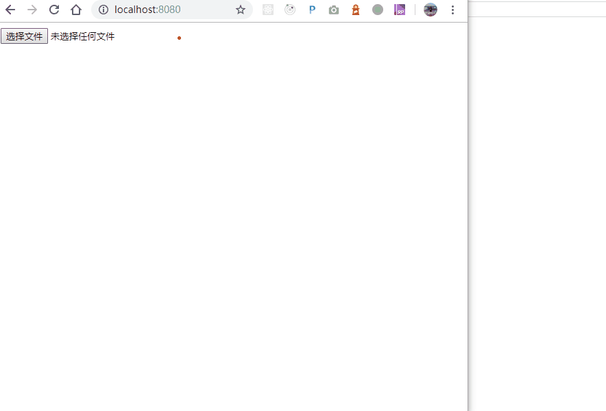

# canvas-merge-images

## install

```
yarn add canvas-merge-images
```

## usage

```
import { mergeFile, mergeBase64 } from 'canvas-merge-images'

let fileInput = document.getElementById('fileinput')
let preview = document.getElementById('preview')

// in case of files
fileInput.onchange = async () => {
  if (!fileInput.files) return
  // you can use `mergeBase64` if you already have base64
  let base64 = await mergeFile(fileInput.files)
  preview.src = base64
  console.log(base64)
}

// in case of base64 strings
let base64 = await mergeFile([
  'data:image/jpeg;base64,/9j/4AAQSkZJRgABAQAAAQABAAD/2w...',
  'data:image/jpeg;base64,/9j/4AAQSkZJRgABAQAAAQABAAD/2w...',
])

// in case you want full quanlity, default 0.92
let base64 = await mergeFile(fileInput.files,{quanlity:1.0})
```


## try on your own

```
git clone this_repo
cd repo
yarn
yarn dev
```

